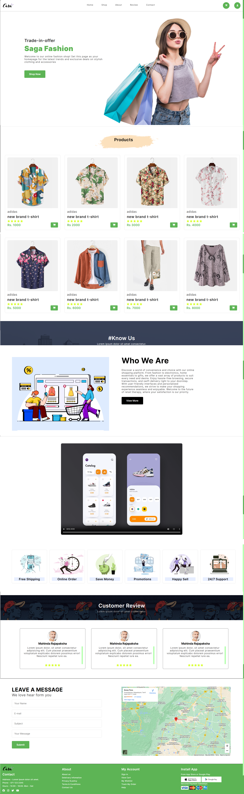

# Saga Fashion Online Shop

## Description
Saga Fashion Online Shop is a comprehensive e-commerce platform designed to provide users with a seamless and enjoyable shopping experience. The website features a wide range of fashion products, including clothing, accessories, and more. With a modern and responsive design, the site ensures that users can easily navigate and shop from any device. Key features include detailed product listings, customer reviews, a contact form, and easy navigation. The project utilizes HTML5, CSS3, JavaScript, Font Awesome for icons, and Google Maps for location embedding.



## Table of Contents

- [Project Overview](#project-overview)
- [Features](#features)
- [Technologies Used](#technologies-used)
- [Setup and Installation](#setup-and-installation)
- [Usage](#usage)
- [Contributing](#contributing)
- [License](#license)

## Project Overview

Saga Fashion Online Shop is a modern e-commerce website designed to offer a wide range of fashion products. The website includes various sections such as Home, Shop, About, Review, and Contact, providing users with a comprehensive shopping experience.

## Features

- **Responsive Design**: The website is fully responsive and works on all devices.
- **Product Listings**: Display of various products with details and prices.
- **Customer Reviews**: Section for customer reviews and ratings.
- **Contact Form**: A form for users to leave messages.
- **Navigation**: Easy navigation with a mobile-friendly menu.

## Technologies Used

- **HTML5**: For structuring the web pages.
- **CSS3**: For styling the web pages.
- **JavaScript**: For interactive elements.
- **Font Awesome**: For icons.
- **Google Maps**: For embedding the map in the contact section.

## Setup and Installation

1. **Clone the repository**:
    ```sh
    git clone https://github.com/amliyanage/saga-fashion-shop.git
    ```

2. **Navigate to the project directory**:
    ```sh
    cd saga-fashion-shop
    ```

3. **Open `index.html` in your browser** to view the website.

## Usage

- **Home Page**: Introduction to the shop with a call-to-action button.
- **Shop Page**: Browse through the products and view details.
- **About Page**: Information about the shop.
- **Review Page**: Customer reviews and ratings.
- **Contact Page**: Leave a message and view the shop location on the map.

## License

This project is licensed under the MIT License. See the [LICENSE](LICENSE) file for details.